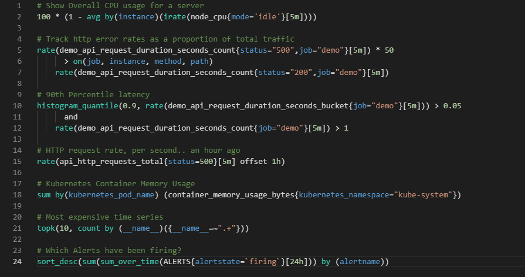

# Monaco PromQL language   

Colorization and configuration supports for PromQL language for the Monaco Editor.

> Samples coming from https://github.com/infinityworks/prometheus-example-queries

## Installation

* initial setup with `npm install .`
* compile with `npm run watch`
* test with `npm run test`

## Usage
Sorry for the moment I only made documentation on how to use it in angular.
- [How to use it in an angular project.](docs/angular_integration.md)

## Roadmap
- [ ] More usage documentation.
- [ ] Versions mapping with PromQL.
- [ ] Provide the auto-completion support.
 
## Credits
This repository is inspired by [monaco-languages](https://github.com/microsoft/monaco-languages) repository.
